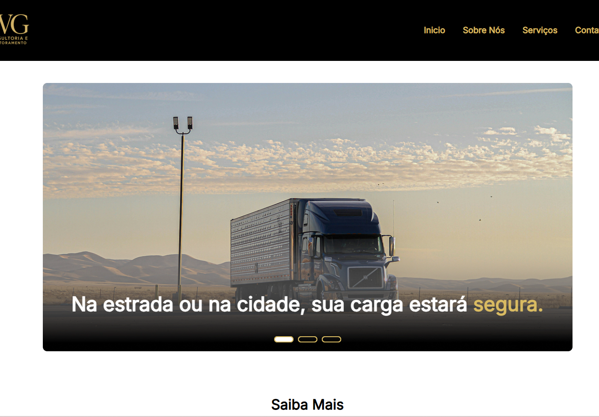
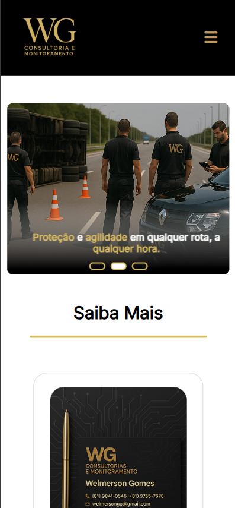

# WG Consultoria e Monitoramento

Site institucional desenvolvido para uma empresa de consultoria e monitoramento logístico, com foco em design moderno, navegação intuitiva e responsividade.

---

## 🚀 Tecnologias Utilizadas

- HTML5
- CSS3
- JavaScript

---

## 🎯 Funcionalidades

- Slider interativo
- Layout responsivo
- Navegação intuitiva
- Sessão de serviços dinâmica
- Interface moderna e corporativa

---

## 📸 Preview

### Desktop

### Mobile

---

## 💡 Objetivo do Projeto

O objetivo deste projeto foi praticar conceitos de desenvolvimento front-end, responsividade e experiência do usuário, simulando um cenário próximo de um projeto real para empresa.

---

## 📚 Aprendizados

Durante o desenvolvimento deste projeto, trabalhei:

- Estruturação semântica
- Responsividade
- Organização visual
- Manipulação de layout com CSS
- Experiência do usuário
- Integração de slider interativo

---

## 🔗 Deploy

Acesse o projeto online:

[Clique aqui]((https://logistica-wg.vercel.app/))

---
## 👨‍💻 Desenvolvedores

Projeto desenvolvido por:

- Igor Aurelino
- Lucas Ferreira
- Diogo Holanda
